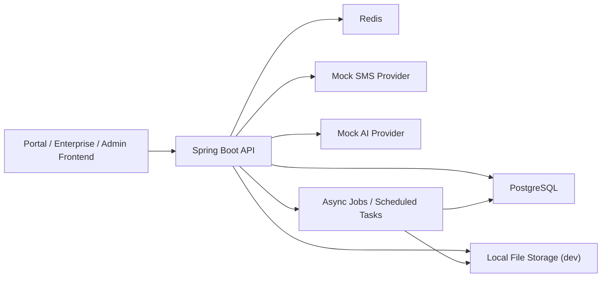

# 工业企业出海主数据平台后端架构设计

## 1. 当前基线

当前仓库已经稳定了三组前端路由：

- 公开门户：`/`、`/platform`、`/onboarding`、`/products`、`/ai-tools`
- 企业端：`/enterprise/*`
- 平台审核端：`/admin/*`

当前前端已经固化的角色与状态，后端必须保持一致：

- 角色：
  - `enterprise_owner`
  - `reviewer`
  - `operations_admin`
- 企业状态：
  - `unsubmitted`
  - `pending_review`
  - `approved`
  - `rejected`
  - `frozen`
- 产品状态：
  - `draft`
  - `pending_review`
  - `published`
  - `rejected`
  - `offline`

前后端对齐基线文件：

- 路由基线：[src/router/index.tsx](/E:/workspace/mdm/src/router/index.tsx)
- 接口 contract：[src/services/contracts/backoffice.ts](/E:/workspace/mdm/src/services/contracts/backoffice.ts)
- 领域类型与状态：[src/types/backoffice.ts](/E:/workspace/mdm/src/types/backoffice.ts)

## 2. 架构结论

一期后端采用：

- `Java 21`
- `Spring Boot 3.x`
- `Spring Web`
- `Spring Validation`
- `Spring Security`
- `Spring Data JPA`
- `PostgreSQL`
- `Redis`
- `Flyway`
- `springdoc-openapi`
- `MapStruct`
- `JUnit 5 + Testcontainers`

开发阶段约束：

- 后端单独放在 `backend/` 目录
- 关系数据库使用本地安装的 `PostgreSQL`
- 对象存储开发阶段使用本地目录
- 短信服务先走 `MockSmsProvider`
- AI Provider 先走 `MockAiProvider`
- 字段字典先使用一期占位值，后续再统一收口

## 3. 为什么要单独开 `backend/`

- 当前前端已经是一个独立的 `Vite` 工程，后端改为 `Spring Boot` 后，生命周期、依赖体系、构建方式都完全不同。
- 分出 `backend/` 后，可以清晰区分：
  - 门户与后台前端
  - Java 后端
  - 本地存储目录
  - 后续数据库脚本、OpenAPI、测试代码
- 后面如果接 CI/CD，也更容易按 `frontend` / `backend` 分流水线。

建议仓库形态：

```text
mdm/
  design/
  docs/
    kickoff/
  src/                      # 当前前端工程
  backend/                  # 新增 Spring Boot 工程
```

## 4. 总体架构

一期采用“模块化单体 + 异步任务”的架构，不一开始拆微服务。



### 4.1 分层原则

- `controller`
  - 只负责协议层、参数校验、返回格式、鉴权入口
- `application`
  - 负责用例编排、事务边界、权限判断、跨模块协作
- `domain`
  - 负责状态机、审核规则、不可变约束
- `repository`
  - 负责聚合读写和查询边界
- `infrastructure`
  - 负责 JPA、Redis、本地文件、mock 短信、mock AI 等技术实现

### 4.2 为什么先不拆微服务

- 企业、产品、审核、类目、消息、导入、审计之间强关联。
- 一期最重要的是快速跑通业务闭环，而不是先投入大量服务治理成本。
- 等接口稳定、流量稳定、团队分工清晰后，再考虑拆成审核域、主数据域、文件域等服务。

## 5. 模块划分

建议按业务模块纵向切分：

- `auth`
  - 登录、注册、忘记密码、验证码、刷新 token、当前用户
- `enterprise`
  - 企业资料、联系人信息、企业当前生效资料
- `enterpriseReview`
  - 企业入驻申请、企业变更审核、审核日志
- `product`
  - 产品主数据、规格、媒体、附件、展示设置
- `productReview`
  - 产品提交审核、上架审核、驳回记录、状态变更
- `category`
  - 基础类目树、启停、排序、类目编码
- `message`
  - 系统通知、审核通知、已读未读
- `file`
  - 图片、营业执照、PDF、导出文件
- `importtask`
  - Excel 校验、导入任务、错误报告
- `audit`
  - 操作审计、状态变更日志、导出日志
- `portal`
  - 门户展示数据接口
- `ai`
  - HS Code 推荐、AI 预留能力

## 6. 目录与包结构建议

```text
backend/
  src/
    main/
      java/com/industrial/mdm/
        common/
          api/
          audit/
          exception/
          security/
        config/
        infrastructure/
          ai/
          sms/
          storage/
        modules/
          auth/
          enterprise/
          enterpriseReview/
          product/
          productReview/
          category/
          message/
          file/
          importtask/
          audit/
          portal/
          ai/
      resources/
        application.yml
        application-dev.yml
    test/
  pom.xml
  .env.example
  README.md
```

模块内部继续按如下结构演进：

```text
modules/product/
  controller/
  application/
  domain/
  repository/
  mapper/
  dto/
  vo/
```

## 7. 数据建模原则

### 7.1 核心原则

- 企业和产品都采用“当前生效数据 + 提交审核快照”双层建模。
- 状态变更必须留痕，不能只更新一个状态字段。
- 企业端所有核心表都必须带 `enterprise_id`，做强数据隔离。
- 文件只保存元数据和存储 key，不直接把物理路径暴露给前端。

### 7.2 一期核心表

- `users`
- `refresh_tokens`
- `login_logs`
- `sms_codes`
- `enterprises`
- `enterprise_profiles`
- `enterprise_submission_records`
- `enterprise_submission_snapshots`
- `products`
- `product_profiles`
- `product_specs`
- `product_media`
- `product_attachments`
- `product_submission_records`
- `product_submission_snapshots`
- `categories`
- `messages`
- `message_receipts`
- `file_assets`
- `import_tasks`
- `import_task_rows`
- `export_tasks`
- `audit_logs`
- `status_change_logs`

### 7.3 状态机

企业状态：

```text
unsubmitted -> pending_review
pending_review -> approved
pending_review -> rejected
approved -> pending_review
approved -> frozen
rejected -> pending_review
frozen -> approved
```

产品状态：

```text
draft -> pending_review
pending_review -> published
pending_review -> rejected
published -> offline
offline -> pending_review
rejected -> pending_review
```

## 8. 安全基线

这部分已经结合安全子代理建议固化为一期强约束。

### 8.1 认证与会话

- 采用 `JWT Access Token + Refresh Token`
- `Access Token` 建议 15 分钟
- `Refresh Token` 建议 7 到 14 天
- `Refresh Token` 仅保存哈希值
- 修改密码、冻结账号、冻结企业时，必须使该账号全部 refresh token 失效

### 8.2 RBAC

- `enterprise_owner`
  - 仅访问自己企业的数据
- `reviewer`
  - 企业审核、产品审核
- `operations_admin`
  - 全局企业/产品管理、产品下架、企业冻结/恢复、基础类目维护

### 8.3 企业数据隔离

- 企业端所有读写必须以后端 token 中的 `enterprise_id` 为准
- 不信任前端传入的企业 ID
- 企业端导出、下载、上传、删除都要强制追加企业隔离条件

### 8.4 文件安全

- 白名单仅开放：`jpg`、`jpeg`、`png`、`webp`、`pdf`、`xlsx`
- 同时校验扩展名、MIME、文件头
- 存储 key 采用随机路径，不使用原始文件名
- 预览与下载走受控接口，不直接暴露物理路径

### 8.5 审计

以下操作必须留审计：

- 登录成功/失败
- 注册、重置密码
- 企业提交审核、审核通过、驳回、冻结、恢复
- 产品新增、编辑、删除、提交审核、上架、下架、导出
- 类目新增、修改、删除、启停
- 文件上传、下载
- 导入、导出

### 8.6 限流与密码策略

- 登录、验证码、上传、导出、审核接口分组限流
- 密码策略按常规平台策略执行：
  - 最少 8 位
  - 至少包含字母和数字
  - 使用 `BCrypt` 保存
- 验证码策略：
  - 6 位数字
  - 5 分钟有效
  - 单手机号 1 分钟 1 次

## 9. 代码质量规范

这部分已经结合代码质量子代理建议收敛为一期标准。

### 9.1 必须启用

- `Spotless`
- `Checkstyle`
- `SpotBugs`
- `JaCoCo`
- `Maven Enforcer`
- `springdoc-openapi`
- `Bean Validation`
- `MapStruct`
- `JUnit 5`
- `Testcontainers`

### 9.2 必须遵守

- Controller 不写业务逻辑
- Entity 不能直接返回给前端
- DTO/VO/Entity 边界明确
- 所有状态使用枚举 code，不使用魔法字符串
- 事务只放在 application service
- 错误码稳定，不允许前端依赖 message 判断逻辑
- 日志必须脱敏，且带 `traceId/requestId`

### 9.3 可后置

- `PMD`
- `SonarQube`
- 更细粒度的 `ArchUnit`
- 集中式日志平台

## 10. 测试基线

这部分已经结合测试子代理建议固化。

### 10.1 测试分层

- 单元测试
- Web Slice 测试
- Repository Slice 测试
- 集成测试
- HTTP 冒烟测试

### 10.2 一期最小必测闭环

- 企业注册/登录
- 企业入驻提交与审核
- 企业资料变更审核
- 产品新增、草稿、提交审核、审核上架、驳回修改
- 产品下架/重新上架申请
- Excel 导入校验与导入
- 文件上传/预览/下载权限
- 消息生成与已读未读
- 企业隔离与角色越权

## 11. API 规范

### 11.1 风格

- RESTful
- 前缀统一：`/api/v1`
- JSON 为主
- 文件上传使用 `multipart/form-data`

### 11.2 响应格式

```json
{
  "code": "OK",
  "message": "success",
  "data": {},
  "requestId": "req_xxx"
}
```

### 11.3 分页格式

```json
{
  "items": [],
  "page": 1,
  "pageSize": 20,
  "total": 128
}
```

### 11.4 接口边界

- `auth`
- `enterprise`
- `enterpriseReview`
- `product`
- `productReview`
- `category`
- `message`
- `file`
- `importtask`
- `portal`

接口命名会优先对齐当前前端 contract，后续再以 OpenAPI 为准统一调整。

## 12. 环境规范

### 12.1 开发环境

- 数据库：本地 `PostgreSQL`
- 存储：`backend/storage`
- 短信：mock
- AI：mock
- Swagger：开启
- 允许调试日志

### 12.2 测试环境

- 独立数据库
- 独立 Redis
- 独立文件目录
- 接近生产的限流和鉴权

### 12.3 生产环境

- 禁止 mock provider
- 强制 HTTPS
- 严格限流
- Swagger 仅内网或鉴权后开放
- 日志脱敏
- 文件目录最小权限

## 13. 本地开发前置条件

截至 **2026-03-21**，当前机器实际检测到：

- `Java 1.8.0_131`
- `Maven 3.9.14`

这不足以支撑 `Spring Boot 3.x`。

因此本地后端开发前，必须先安装并切换到：

- `JDK 21`
- `PostgreSQL` 本地实例
- `Redis` 本地实例或 Docker 实例

## 14. 一期实施顺序

1. 初始化 `backend/` 工程骨架、配置、质量插件、基础目录。
2. 先落认证、安全、请求链路、统一响应与异常处理。
3. 再落企业入驻、企业审核。
4. 再落产品、产品审核。
5. 再落消息、类目、导入、文件。
6. 最后补门户发布接口和 AI mock 预留。

## 15. 当前建议

下一步直接进入后端开发时，优先顺序如下：

1. 先完成 `auth + enterprise + enterpriseReview`
2. 再完成 `product + productReview`
3. 然后补 `message + category + file + importtask`
4. 最后再把门户接口从 mock 切到真实后端
